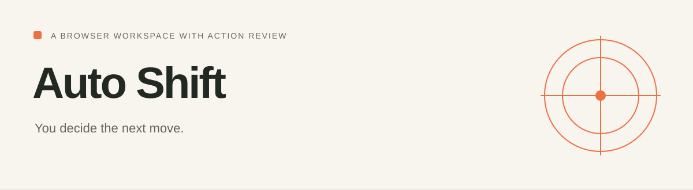

[Project website](https://honeyamn10-source.github.io/auto-shift/) · [Build results](https://github.com/honeyamn10-source/auto-shift/actions)

# Auto Shift

<!-- repo-badges:start -->
<div align="center">

[](https://github.com/honeyamn10-source/auto-shift/stargazers)
[](https://github.com/honeyamn10-source/auto-shift/forks)
[](https://github.com/honeyamn10-source/auto-shift/issues)
[](https://github.com/honeyamn10-source/auto-shift/commits/main)

[Repository](https://github.com/honeyamn10-source/auto-shift) · [Issues](https://github.com/honeyamn10-source/auto-shift/issues) · [Pull Requests](https://github.com/honeyamn10-source/auto-shift/pulls) · [Actions](https://github.com/honeyamn10-source/auto-shift/actions)

</div>
<!-- repo-badges:end -->

<!-- professional-meta:start -->
<div align="center">

[](https://github.com/honeyamn10-source/auto-shift/actions/workflows/ci.yml)

  

[Architecture](docs/ARCHITECTURE.md) · [Documentation](docs) · [Contributing](CONTRIBUTING.md) · [Security](SECURITY.md) · [Changelog](CHANGELOG.md)

</div>
<!-- professional-meta:end -->


### A browser workspace where you approve the next move.

Auto Shift runs a visible Chromium browser on your computer and connects it to a Browser Use agent. Describe a task, review the proposed action, then approve or stop it.

**Status: first implementation.** Automated checks are in [GitHub Actions](https://github.com/honeyamn10-source/auto-shift/actions). A complete model-driven task, real account sign-in, and desktop operation still need acceptance testing; this is not a claim of production readiness.

## What is included

- Local dashboard with a task composer, browser snapshots, action review and a run timeline.
- Real browser navigation through **Browser Use 0.13.10**.
- OpenAI API or local Ollama model adapters.
- Approval before each planned action, with one-use approval IDs and five-minute expiry.
- Stop/reject controls and manual takeover of the separate browser window.
- A dedicated persistent browser profile.
- Optional exact-hostname restrictions.
- Result export as a text file.
- API authentication, origin checks, host validation, no-store responses and a restrictive content security policy.
- Windows and macOS/Linux launchers, dependency setup, and CI.

## Start on your computer

Install **Python 3.12** and Git, then:

```bash
git clone https://github.com/honeyamn10-source/auto-shift.git
cd auto-shift
python setup.py
python launch.py
```

Use `python3` on macOS/Linux if needed, or `py -3.12` on Windows. Setup downloads dependencies and Chromium; allow time and disk space for those downloads.

After setup, you can also use **START_WINDOWS.cmd** or run `sh START_MAC_LINUX.sh`.

The launcher prints a private localhost link and opens it in your default browser. Keep the terminal running. The service listens only on **127.0.0.1:8765**.

On Linux, if Chromium reports missing system libraries, install them using:

```bash
.venv/bin/python -m playwright install-deps chromium
```

This system-package step may need administrator access. A graphical desktop session is required for the visible browser.

## First task

1. Optionally enter allowed hostnames, then choose **Open browser**.
2. Sign in manually in the separate Chromium window if your task needs an account.
3. Select **OpenAI API** and enter an available model and API key, or select **Local Ollama** and enter the exact name of an installed model.
4. Start with a simple public-page task.
5. Review the browser snapshot and proposed action before approving.
6. Use **Stop for manual control** whenever you need to intervene. After changing the page manually, start a fresh task so the agent observes the new state.

The API key field is cleared when submitted. It is not saved by the dashboard. You can alternatively copy `.env.example` to `.env` and configure your key locally.

Ollama runs at `http://127.0.0.1:11434` by default. A model must support the structured output used by Browser Use; enable vision only for a model that accepts images. Local models vary substantially in reliability and memory requirements.

## What this does not provide

- It does not connect to ChatGPT's browser, reuse ChatGPT sign-in, or obtain model API access from a ChatGPT subscription.
- It is a local desktop application, not a multi-user cloud service or mobile app.
- It does not bypass website bot checks, CAPTCHAs or authentication restrictions.
- Face ID and passkey behavior depends on the operating system and Chromium; it has not been validated here.
- Browser snapshots update at review steps, not as a live video stream.
- Stopping cannot undo an action that has already executed.
- A domain restriction constrains navigation; it is not a complete network or filesystem sandbox.
- The agent can still make incorrect choices. The prompt asks it to hand off sensitive tasks, but the approval gate does not semantically prove an action is safe.

## Data and access

The browser profile, downloads and agent working files are kept under `.runtime/`, which is Git-ignored. The profile contains login state; protect it like a signed-in browser. Page text and images may be sent to the selected model provider. Local Ollama avoids a hosted model connection, but websites still use the internet.

Do not expose the service through a public tunnel. Do not share the private launch link. Never put passwords or one-time codes in a task or public issue.

## Development

```bash
.venv/bin/python -m unittest discover -s tests -p "test_*.py" -v
.venv/bin/python tests/smoke_browser.py
```

On Windows use `.venv\\Scripts\\python.exe`. The smoke test opens a headless browser against a local fixture; it does not call a model or sign into any service.

See [architecture and limitations](docs/ARCHITECTURE.md), [acceptance checks](docs/ACCEPTANCE.md), and [open-source choices](docs/OPEN_SOURCE.md).
